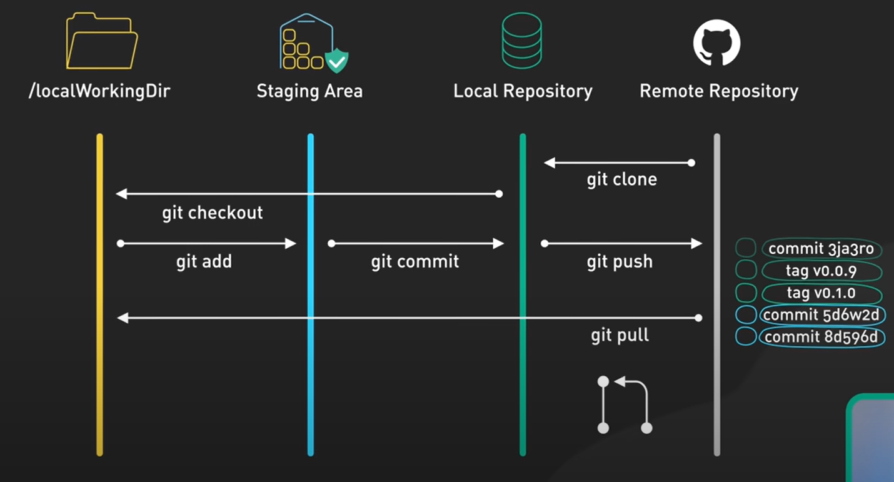

# MovieInternet

## jo jo

### hello

```C
Serial.println("hello world")
```

1. good
2. use of
3. my
4. time

- yes
- no
- hello

# MovieInternet

**Why did we start this project**
We are a group of ICT students that would like to get deeper into the subjects such as AI, front end development and overall development of the applications according to the industry standards. This project is overlooked by our mentor/projectlead ... 


**what is movie internet**
---

**Which technologies did we use**
---

**Working with github:**  
We would like to bring everybody in the team up to speed and set in stone in what way we'll set up our github repository and which rules every member of the team will have to follow. 


*   When to pull
    * Fetch origin - Fetching code from the remote repository
    * Merge - Combining changes from different files
  
* what are commits - uploading changes to the local repository
* what is push - uploading changes from local to remote repository
* When to push - when you have pulled
*   
  **Working with branches**

  * Copy of the source code you don't want to mess with
  * You want to know exactly what changes have been made in this way it's much easier to navigate when something in the code went wrong 
  * branch - copy of what is already working
  * git tracks changes using different algorithms
  * Git recognizes different types of content
  * add empty lines → Git sees them as insertions
  * change lines → Git sees them as modifications
  * remove lines → Git sees them as deletions
  

  Sources:
  [CodeOps Show: GIT: Working with Branches](https://www.youtube.com/watch?v=JTE2Fn_sCZs)

  
Source:[ByteByteGo video](https://www.youtube.com/watch?v=e9lnsKot_SQ)

Directories
* Working directory
- Git clone
* Staging area
* Local Repository
* Remote repository

  prompts chat GPT 
  ---

  - what is container, what is docker image, what is dockerfile, what is docker-compose
  - lets say I am working with branches on git and I have a main, frontand1 and frontend2 lets say that programmer A has modified and pushed changes to the "buttonFunction" in frontend 1. Afterward the programmer B has made changes in the "buttonFunction" in the frontend2 and then pulled the changes from git, with which version of the "buttonFunction" would Programmer B end up with?
  - what if programmers A changes would be to push enter just ones at the beginning of the function. and programmer B changed a couple lines of code. 
  If programmer B would pull origin of frontend1 would he now have to resolve a merge conflict seeing that no all the lines have been moved by one?
  How could programmer B solve that issue and merge code implementing both changes?


**Setting up dual-boot windows/linux**
Prep
* Back up your systems
* Download an ISO file for the linux distro
* Flash the USB with the ISO file (you can use Rufur or etcher)


**How to set up dual-boot?**

Restart you system and while in boot click on F12 for Boot menu. than select your flashed usb as boot device. Than you will be able to choose install "insert linux distro" on the desktop. When you click it you will go through the installation options (adjust accordingly). After the first couple screens a installation type heading will show up. You should choose to install your linux alongside your windows boot manager. After that you will be able to choose how much space you would like to dedicate to the project (we will be going with 250 GB). Write your changes and go on with the installation. Now when you restart you will be able to choose to either boot windows o linux.

Tips:
* If F12 does not work just google the model of your computer.
sources:  
[ExplainingComputers: Windows & Linux: Dual Drive Dual Boot](https://www.youtube.com/watch?v=KWVte9WGxGE)

***Backing up you system***

* Drive clone
* External drive reader + Extra drive + Clonezilla
* Cloud - limited use
* Carbonite - limited use (very safe)
Free options
* Fbackup - You just need an extarnal storage unit (Can schedule backup)

[Ask Your Computer Guy: How to clone a hard drive - EASY step by step walk-thru!](https://www.youtube.com/watch?v=-89EcTjzl4M&t=832s)  

**Getting started with docker**

